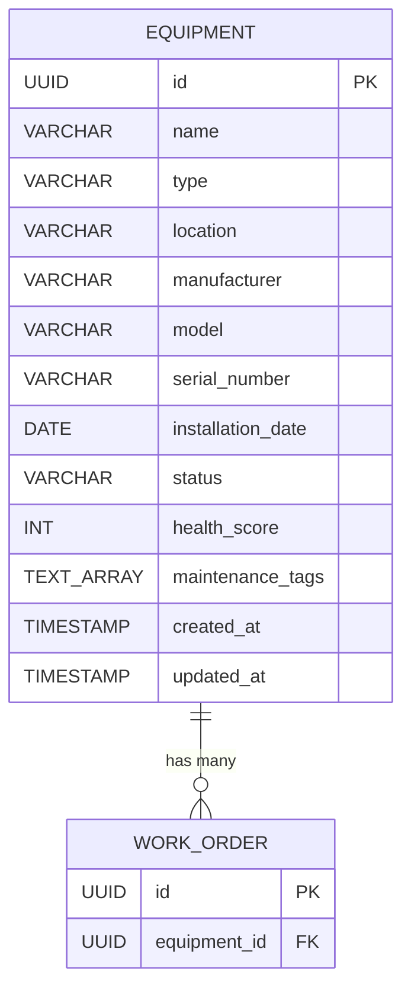

# Product Requirements Document & Design Artifacts

## 1. Equipment Database Schema (PostgreSQL reference)

While the application is currently using Firebase Firestore for rapid prototyping and flexibility, the canonical relational schema for the Equipment entity is designed as follows to support future PLCs and ERP integration:

```sql
CREATE EXTENSION IF NOT EXISTS "uuid-ossp";

CREATE TABLE equipment (
    id UUID PRIMARY KEY DEFAULT uuid_generate_v4(),
    name VARCHAR(255) NOT NULL,
    type VARCHAR(100) NOT NULL,
    location VARCHAR(255) NOT NULL,
    manufacturer VARCHAR(255),
    model VARCHAR(255),
    serial_number VARCHAR(100) UNIQUE,
    installation_date DATE,
    status VARCHAR(50) DEFAULT 'Operational' CHECK (status IN ('Operational', 'Warning', 'Down', 'Decommissioned')),
    health_score INTEGER CHECK (health_score BETWEEN 0 AND 100),
    maintenance_tags TEXT[], -- Array of strings for flexible tagging
    created_at TIMESTAMP WITH TIME ZONE DEFAULT CURRENT_TIMESTAMP,
    updated_at TIMESTAMP WITH TIME ZONE DEFAULT CURRENT_TIMESTAMP
);

-- Indexing for search performance
CREATE INDEX idx_equipment_location ON equipment(location);
CREATE INDEX idx_equipment_status ON equipment(status);
CREATE INDEX idx_equipment_type ON equipment(type);
```

### ERD Snippet


## 2. User Roles & Permissions

*   **Technician (Level I, II, III)**
    *   **Access:** Can view assigned work orders, scan equipment QR codes, and view equipment history.
    *   **Modify:** Can update work order status, add repair notes, upload photos, and consume parts inventory. Cannot delete equipment or schedules.
*   **Supervisor**
    *   **Access:** Full visibility across all shifts, equipment, and technicians. Access to reporting dashboards.
    *   **Modify:** Can create, edit, assign, and approve work orders. Can adjust PM schedules. Can edit equipment details.
*   **Administrator**
    *   **Access:** System-wide access, including audit logs, system configurations, and integration settings (ERP/PLCs).
    *   **Modify:** Can manage users, alter permissions, modify core system taxonomies, and manage billing/licensing.

## 3. QR Code Scanning Workflow (Tablet UI/UX)

**Step 1: Initiation**
*   Technician taps the prominent "Scan QR" button on the global topbar or dashboard.
*   The camera activates inside a modal or full-screen overlay with a guided scanning bounding box.

**Step 2: Processing & Feedback**
*   *Success:* Haptic feedback (vibration on tablet) and a satisfying audible chime. A green checkmark flashes.
*   *Error/Invalid QR:* Red outline, negative haptic feedback, and a clear error message ("Unrecognized tag. Try again or enter ID manually.").

**Step 3: Contextual Routing**
*   The app decodes the equipment ID and immediately routes to the `Equipment Detail Profile`.
*   The profile loads offline-first via local cache, fetching live PLC metrics (temp, vibration) asynchronously.

**Step 4: Action Selection**
*   The technician is presented with high-contrast, large-touch-target buttons: "Create Work Order", "View History", "Start PM Checklist".
